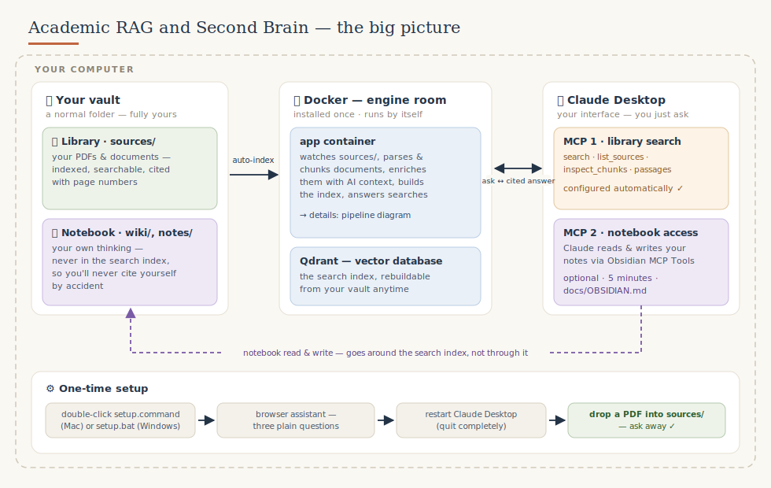
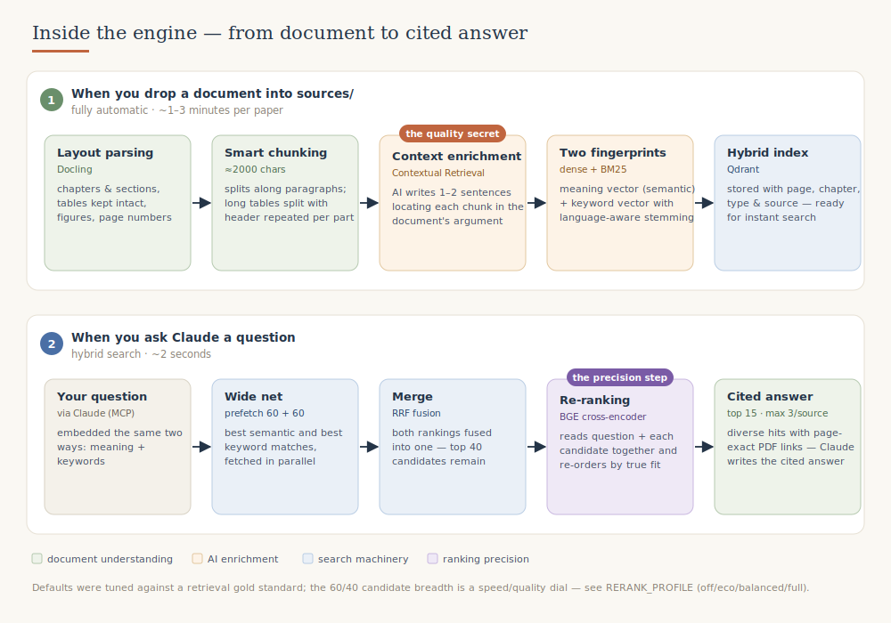

# BRAG — Building Retrieval-Augmented Generation

**🇬🇧 [English](README.md) | 🇩🇪 Deutsch**  ·  **Version 0.3.0** ([Änderungen](#versionen))

> **Sprich mit deiner eigenen Fachliteratur.** PDFs in einen Ordner werfen —
> Paper, Bücher, Berichte, Projektunterlagen — und Claude in normaler Sprache
> fragen. Die Antwort steht **belegt in deinen eigenen Quellen**: seitengenau,
> mit Zitat und einem Klick aufs Original-PDF. Alles läuft lokal auf deinem
> Rechner.

Der Name **BRAG** steht für *Building Retrieval-Augmented Generation* — ein
Wortspiel mit meinem Fach (Bauingenieurwesen) und mit dem, was das Werkzeug tut:
Es **baut** dein Wissen auf und ruft es per RAG-Suche bei Bedarf wieder ab.

Ein „zweites Gehirn" für die Forschung ist nichts grundlegend Neues — aber
dieses hier ist ein **richtig solides Setup**, das im Alltag wirklich trägt. Ich
teile es, weil ich selbst täglich damit arbeite und andere etwas davon haben:
kein Hype, kein Lock-in, sondern einfache Dateien, die dir gehören, eine starke
Suche darüber und Claude als Gegenüber, das **nie ohne Beleg** antwortet.

**Für wen?** Forschende, Lehrende und Promovierende — und genauso Praktiker, die
im Projektalltag den Überblick über Normen, Berichte, Leistungsverzeichnisse und
Fachliteratur behalten müssen. **Ohne Programmierkenntnisse nutzbar.**

---

## Was du damit machst

- 🔎 **Finden statt blättern** — *„Was sagt mein Korpus zum Nachtragsmanagement?"*
  Antwort mit Seitenbeleg, ein Klick öffnet das PDF an genau der Stelle.
- 📊 **Zahlen & Tabellen ziehen** — *„Finde Tabellen mit Kostenkennzahlen zu
  Nacharbeit"* — auch Abbildungen werden inhaltlich beschrieben und sind so
  auffindbar.
- ✍️ **Schreiben mit Belegen** — beim Lesen zitierfähige Passagen sammeln, beim
  Entwerfen *„Bau den Absatz aus diesen Passagen, Belege beibehalten."*
- 🎓 **Lehre vorbereiten** — *„Entwirf drei Klausurfragen aus Kapitel 4, mit
  Seitenangaben."*
- 🧠 **Denken festhalten** — Ergebnisse landen als Notiz in deinem Wissensspeicher; ein
  neuer Chat Tage später macht genau dort weiter, wo der letzte aufhörte.
- 🗂️ **Nach Projekt/Kurs filtern** — *„Such **nur im Projekt Schulzentrum**:
  Welche Position deckt die Erdarbeiten ab?"*

Der Kerngedanke: **Chats vergessen — dein Wissensspeicher nicht.** Wissen sammelt sich in
deinen Dateien an, nicht in einem flüchtigen Chatverlauf.

## Einrichten — realistisch etwa 1 Stunde

Aktiv zu tun ist wenig; die Zeit geht fast komplett für **Downloads** drauf
(Docker Desktop, Claude Desktop und einmalig ~3 GB Analyse-Modelle beim ersten
Start).

**Du brauchst** (alles kostenlos): [Docker Desktop](https://www.docker.com/products/docker-desktop/),
[Claude Desktop](https://claude.com/download) und einen API-Schlüssel —
am einfachsten [Gemini](https://aistudio.google.com/apikey) (Free Tier);
alternativ [OpenAI](https://platform.openai.com/api-keys) oder
[Anthropic](https://console.anthropic.com/). Lieber alles lokal? Geht auch —
mit [LM Studio](https://lmstudio.ai) oder [Ollama](https://ollama.com).

1. **Herunterladen & ablegen:** grüner „Code"-Knopf → „Download ZIP". Leg die
   ZIP an einen festen, gut erreichbaren Ort — z. B. in dein Projekt- oder
   Arbeitsverzeichnis oder einen übergeordneten Ordner (gern auch in OneDrive) —
   und **entpacke sie dort**. Dieser Projektordner bleibt dauerhaft liegen (er
   enthält die Steuerung, deine Konfiguration und standardmäßig deinen
   Wissensspeicher) — verschieben ist ok, löschen nicht.
2. **Doppelklick** auf `setup.command` (Mac) bzw. `setup.bat` (Windows). Der
   Assistent öffnet sich **im Browser** und fragt in einfacher Sprache: wo die
   KI rechnen soll, deinen Schlüssel (mit Live-Prüfung), die Dokumentsprache.
   Er schreibt die ganze Konfiguration selbst — **du editierst nie eine Datei.**
3. **Claude Desktop komplett beenden** (Cmd+Q / Tray → Beenden) und neu öffnen.
4. **Ein PDF in `wissensspeicher/sources/` legen** — binnen Sekunden automatisch indexiert.
5. Claude fragen: *„Welche Dokumente sind in meiner Wissensbasis?"*

**Läuft alles?** Doppelklick auf `status.command` (Mac) bzw. `status.bat`
(Windows) prüft mit einem Klick Docker, Qdrant, den Watcher, den Korpus und den
KI-Anschluss — ✓/✗ pro Punkt.

Der erste Start lädt einmalig ~3 GB Analyse-Modelle. Ausführlich, mit „was du
siehst": [Installation macOS](docs/INSTALL_MAC.de.md) ·
[Windows](docs/INSTALL_WINDOWS.de.md).

## Die Idee: eine Bibliothek und ein Notizbuch

Ein „Second Brain" für die Forschung hat zwei Hälften — und ihre strikte
Trennung ist der Kern dieses Designs:

|  | 📚 **Deine Bibliothek** | 📓 **Dein Notizbuch** |
|---|---|---|
| Ordner | `wissensspeicher/sources/` | `wissensspeicher/wiki/`, `wissensspeicher/notes/`, `wissensspeicher/passages/` |
| Enthält | externe Quellen: Paper, Bücher, Berichte | **dein eigenes Denken**: Konzepte, Entwürfe, Lesenotizen |
| Von Claude durchsuchbar? | ja — hybride Suche mit seitengenauen Belegen | bewusst **nein** |
| Kann Claude lesen/schreiben? | nur lesen (über die Suche) | ja — über die optionale Obsidian-Anbindung |

**Warum ist das Notizbuch vom Suchindex ausgeschlossen?** Wegen des
Echo-Effekts: Wären deine eigenen Notizen indexiert, würdest du eines Tages
deine eigene Zusammenfassung eines Papers „finden" und als Beleg zitieren —
ohne zu merken, dass du dich selbst zitierst. Die Bibliothek beantwortet *„Was
sagen meine Quellen?"*; das Notizbuch enthält, *was du daraus machst*. Claude
arbeitet mit beidem — verwechselt sie aber nie.

### Dein Notizbuch — und warum einfache Markdown-Dateien

Das Notizbuch (`wiki/`) ist der Teil, der aus der Suche ein *zweites Gehirn*
macht: Hier steht **dein** Denken — Konzeptseiten, Argumentationslinien, offene
Fragen, Entscheidungen. Nicht, was die Quellen sagen, sondern was *du* daraus
machst.

**Warum als einfache Markdown-Dateien (`.md`)?** Markdown ist nur Text mit ein
paar Zeichen für Überschriften, Listen und Links. Klingt unspektakulär — ist
aber der entscheidende Vorteil:

- **Es gehört dir und hält.** Eine `.md`-Datei öffnest du in 20 Jahren noch, mit
  jedem Editor, ohne Spezialprogramm und ohne Abo. Kein proprietäres Format,
  kein Anbieter, der dichtmacht — kein Lock-in.
- **Es läuft überall.** Dieselbe Datei lesen und schreiben Obsidian, Claude,
  dein Texteditor, dein Backup, Git. Verschieben, kopieren, sichern wie jede
  andere Datei.
- **Es lässt sich verknüpfen.** Mit `[[Wikilinks]]` verbindest du Konzepte zu
  einem Netz — dein Wissen wird durchwanderbar statt in Dokumenten vergraben.

**Der unbequeme Teil:** Ein zweites Gehirn entsteht nicht von allein — du musst
dir das **Dokumentieren angewöhnen.** Die Quellen sammeln sich automatisch,
deine Erkenntnisse nicht. Faustregel: nach einem guten Gespräch mit Claude oder
einer wichtigen Lesestelle **kurz festhalten, was hängenbleibt** — lieber drei
unfertige Sätze als die perfekte Notiz, die nie entsteht. Claude kann dir beim
Schreiben helfen (über die Obsidian-Anbindung). Mit der Zeit wird daraus, was
kein Chatverlauf je sein kann: **dein** wachsendes, durchsuchbares Wissen.

## Wie es funktioniert



Alles läuft in zwei Docker-Containern auf deinem Rechner. Im Cloud-Profil
verarbeitet ein KI-Anbieter nur die Dokumenttexte; in den Lokal-Profilen
verlässt nichts deinen Rechner. Eine ausführliche, technikfreie Erklärung steht
in **[So funktioniert's](docs/HOW_IT_WORKS.de.md)** — hier das Wichtigste.

**Was ist Docker?** Statt Python, Datenbanken und KI-Bibliotheken einzeln zu
installieren (und mit Versionskonflikten zu kämpfen), startet Docker eine fertig
geschnürte Box, die auf jedem Rechner identisch ist. Du installierst einmal
Docker Desktop; den Rest startet das Projekt. Die ~3 GB Modelle liegen in Dockers
verwaltetem Speicher — **nicht** in deinem Projektordner; dein `wissensspeicher/` enthält
nur deine eigenen Dateien.



Die Antwortqualität entsteht in zwei Abläufen:

**Beim Einlesen** schreibt eine KI zu jedem Textabschnitt 1–2 einordnende Sätze
(*Contextual Retrieval*) — knapper Fachtext wird so überhaupt erst auffindbar.
Abbildungen werden von einem multimodalen Modell beschrieben (*Vision-Pass*).
Jeder Abschnitt bekommt zwei „Fingerabdrücke": einen für die **Bedeutung**
(semantische Suche) und einen für **exakte Begriffe** (Stichwortsuche).

**Bei jeder Frage** läuft die Abfragepipeline — von der Frage bis zum Beleg:

1. **Zwei Suchen gleichzeitig** — Bedeutungssuche (findet Sinnverwandtes, auch
   mit anderen Worten) **und** Stichwortsuche (BM25; findet exakte Begriffe wie
   Abkürzungen, Paragraphen, Aktenzeichen). Je ~150 Kandidaten.
2. **Zusammenführen (RRF)** — beide Listen verschmelzen; ~80 bleiben übrig.
3. **Reranker** — ein Cross-Encoder liest deine Frage gemeinsam mit jeder Stelle
   und sortiert nach echter Passung. Der Unterschied zwischen „enthält die
   Suchworte" und „beantwortet die Frage".
4. **Kürzen** — die besten Treffer bleiben (Standard 15, max. 3 je Quelle).
5. **Antworten** — Claude formuliert aus genau diesen Stellen, jede Aussage mit
   Quelle und Seite belegt.

Mehr Tiefe (mit Zahlen) in [So funktioniert's](docs/HOW_IT_WORKS.de.md) und
[Architektur](docs/ARCHITECTURE.de.md); alle Parameter in [`.env.example`](.env.example).

## Die zwei Claude-Anschlüsse (MCP)

Claude Desktop spricht über zwei MCP-Server mit deinem Second Brain:

**1. Der Such-Anschluss** (dieses Projekt — wird automatisch eingerichtet) gibt
Claude diese Werkzeuge:

| Werkzeug | Was es tut | Beispielfrage |
|---|---|---|
| `search` | Hybride Suche mit Filtern (Typ, Jahr, nur Tabellen/Abbildungen, Quelle) | *„Was sagt mein Korpus zum Nachtragsmanagement?"* |
| `list_sources` | Inventar aller indexierten Dokumente | *„Welche Dokumente sind in meiner Wissensbasis?"* |
| `inspect_chunks` | Zeigt, was zu einer Quelle gespeichert ist (Diagnose) | *„Zeig, was von Müller 2023, S. 14 indexiert wurde."* |
| `save_passage` | Speichert einen zitierfähigen Treffer unter einem Thema | *„Speichere dieses Zitat fürs Methodenkapitel."* |
| `list_passages` | Zeigt gesammelte Passagen pro Thema | *„Was habe ich fürs Methodenkapitel schon gesammelt?"* |

**2. Der Notizbuch-Anschluss** (optional, ~5 Minuten) lässt Claude über das
Plugin **MCP Tools für Obsidian** auch deine Notizen lesen und fortschreiben,
während der Suchindex unberührt bleibt. Anleitung: [docs/OBSIDIAN.de.md](docs/OBSIDIAN.de.md).

Mit beiden zusammen: *„Such Definitionen von Prozessreife (Bibliothek),
vergleiche mit meiner Konzeptnotiz (Notizbuch) und ergänze, was fehlt — mit
Belegen."*

## Wähle dein Profil

Das Profil wählt nur die **Text-KI** (Kontext schreiben, Abbildungen
beschreiben, klassifizieren). Der **Bedeutungs-Index (Embeddings) läuft immer
lokal** (arctic-Modell, keine GPU nötig) — du kannst den Anbieter also jederzeit
wechseln, **ohne neu zu indexieren.**

| Profil | Text-KI | Günstigstes Modell | Hardware | Daten verlassen Rechner |
|---|---|---|---|---|
| **Gemini** (Standard) | Google Gemini (Free Tier) | gemini-2.5-flash-lite | jeder Laptop | ja (Google) |
| **OpenAI** | OpenAI / ChatGPT | gpt-4o-mini | jeder Laptop | ja (OpenAI) |
| **Claude** | Anthropic Claude | claude-haiku-4-5 | jeder Laptop | ja (Anthropic) |
| **Hybrid** | LM Studio (auf deinem Mac) | dein lokales Modell | Apple Silicon, 32 GB+ | nein |
| **Lokal** | Ollama (auf deinem Rechner) | llama3.1 | ordentliche CPU, 16 GB+ | nein |

Bei einem Cloud-Profil geht der **Textauszug** jedes Abschnitts an den Anbieter —
bei aktivem Vision-Pass (Standard) zusätzlich die **Bilder deiner Abbildungen**.
Nie übermittelt werden ganze Dateien und die Embeddings. Bei lokalen Profilen
verlässt nichts den Rechner.

> ⚠️ **Datenschutz, kurz und ehrlich:** Beim **kostenlosen Gemini-Tarif**
> (Standard) darf Google die übermittelten Texte/Bilder auswerten. Faustregel:
> Was du Claude bisher nicht anvertraut hättest, lädst du auch hier nicht hoch.
> Für Vertrauliches oder Personenbezogenes nimmst du einfach ein **lokales
> Profil** (dann verlässt nichts den Rechner) oder schaltest den Bildversand mit
> `VISION_ENABLED=false` ab. Und wer's elegant will, baut sich eine
> Anonymisierung als eigenes Tool davor (siehe [Ausbau](#ausbau--automatisierung-mit-claude-code--co)).
> Mehr unter [Rechtliches & Datenschutz](#rechtliches--datenschutz).

**Kosten:** Jedes Profil ist auf sein günstigstes brauchbares Modell
voreingestellt; für einen typischen Korpus bleiben die Kosten im **Cent-Bereich**.
**Hardware:** Starke Hardware brauchst du nur für eine *lokale* Text-KI — die
Embeddings laufen überall auf der CPU. Details, Modell-Empfehlungen und das
Cloud-Embedding-Opt-in: [docs/PROFILES.de.md](docs/PROFILES.de.md).

## Dein Wissensspeicher

Hier die wichtigste Unterscheidung — **zwei Ordner, zwei Rollen:**

- **Der Projektordner** = das **Programm** (die entpackte ZIP). Den brauchst du
  zum Starten/Stoppen; **nicht löschen.** *Wo* er liegt, ist egal
  (Arbeits-/Projektverzeichnis, OneDrive …) — Hauptsache, er bleibt liegen.
- **Dein Wissensspeicher** = deine **Inhalte**. Standardmäßig ist das der
  Unterordner `wissensspeicher/` *im* Projektordner. Beim Setup kannst du
  stattdessen einen **bestehenden Ordner** angeben — z. B. deinen vorhandenen
  „Projekt XY"-Ordner — und ihm beim Einrichten Zugriff geben.

**Die eine Regel, die alles erklärt:** Durchsucht wird genau **dieser eine
Ordner**. Alles, was du in `sources/` legst, wandert automatisch in die
Suchdatenbank (den Index); nimmst du eine Datei wieder heraus oder löschst sie,
verschwindet sie auch aus der Datenbank. Sonst wird **nichts** auf deinem
Rechner angefasst.

So ist der Wissensspeicher aufgebaut:

```
wissensspeicher/
├── CLAUDE.md      ← bringt Claude DEINE Forschung bei — ausfüllen!
├── AGENTS.md      ← Zusatzregeln für autonome Agenten-Aufgaben
├── sources/       ← 📚 Dokumente hier ablegen (PDF, DOCX); Unterordner = Dokumenttypen
│   └── _inbox/    ← Staging-Bereich, wird vom Indexer ignoriert
├── notes/         ← auto-generierte Literaturnotiz pro Quelle
├── passages/      ← über Claude gespeicherte Zitate, nach Themen
└── wiki/          ← 📓 dein eigenes Denken — wird nie indexiert
```

Umbenennen oder Löschen in `sources/` wird automatisch nachgezogen: Benennst du
eine **bereits indexierte** Datei um, werden nur die Metadaten (Autor, Jahr, Typ,
PDF-Pfad) im Index aktualisiert — **ohne neu einzulesen** (kein erneutes
Embedding, keine API-Kosten); löschst du sie, verschwindet sie aus der Datenbank.
Unterordner-Namen werden zum filterbaren Dokumenttyp (`sources/Paper/`,
`sources/Berichte/` …).

**Eigene Metadaten** (Projekt, Kurs, Auftraggeber …) gibst du über eine
`_meta.txt` in einem Ordner unter `sources/` an — eine Zeile pro `schlüssel: wert`:

```
# sources/Projekte/Schulzentrum/_meta.txt
projekt: Schulzentrum
auftraggeber: Stadt Hamm
```

Jedes Dokument im Ordner trägt diese Felder; Claude filtert im Gespräch danach.
So mischen sich keine Treffer aus anderen Projekten in deine Ergebnisse.

### Obsidian: ein schönerer Blick auf denselben Ordner

Du kannst den Wissensspeicher mit [Obsidian](https://obsidian.md) (kostenlos)
öffnen — es stellt die Markdown-Dateien viel schöner dar und macht das Schreiben
im Notizbuch angenehm. Wichtig zu verstehen: **Obsidian ist kein zweiter
Speicher, sondern nur eine Ansicht auf genau denselben Ordner.** Es arbeitet
direkt auf den Dateien — **löschst du eine Datei in Obsidian, ist sie auch im
normalen Ordner (und damit aus dem Index) weg.** Nichts wird importiert oder
kopiert; es ist dieselbe Struktur, nur bequemer zu bedienen. Schritt für Schritt:
[docs/OBSIDIAN.de.md](docs/OBSIDIAN.de.md).

## Im Alltag: so wächst dein Wissen

**Neue Literatur trifft ein:** in `sources/` ablegen → in Minuten indexiert →
*„Was ergänzt das zu dem, was ich schon zu Nacharbeitskosten habe? Widerspricht
es Müller 2021?"* — Antwort mit seitenverlinkten Belegen.

**Eine Idee entwickeln:** *„Was sagen meine Quellen zu Reifegradmodellen? Wo
widersprechen sie sich?"* → Ergebnis als Konzeptnotiz nach `wiki/` schreiben →
Tage später im neuen Chat genau dort weitermachen.

**Beim Schreiben:** zitierfähige Passagen je Thema sammeln, dann den Absatz
daraus entwerfen lassen — Belege bleiben erhalten.

**Claude mitwachsen lassen:** Korrigierst du Claude zweimal dieselbe Sache,
gehört die Korrektur in **`wissensspeicher/CLAUDE.md`**, nicht in den nächsten Chat. Eine
gepflegte Instruktionsdatei macht aus einem generischen Assistenten *deinen* —
Beispiele: [docs/CUSTOMIZE_CLAUDE.de.md](docs/CUSTOMIZE_CLAUDE.de.md).

## Ausbau & Automatisierung (mit Claude Code & Co.)

Das Fundament ist bewusst offen: einfache Dateien, übersichtliche Python-Module,
Docker und **MCP** — derselbe offene Standard, über den Claude seine Werkzeuge
anspricht. Das macht das Projekt zu einer **Basis zum Weiterbauen**, nicht zu
einer geschlossenen App. Mit **Claude Code** oder einem anderen Coding-Agenten
kannst du den Code lesen lassen, neue Werkzeuge ergänzen und Abläufe
automatisieren — die [Architektur](docs/ARCHITECTURE.de.md) ist dafür
dokumentiert.

Mögliche Ausbaurichtungen (offene Architektur, noch nicht fertig eingebaut):

- **Weitere Datenquellen anbinden** — E-Mail und Kalender, Cloud-Speicher,
  Referenzmanager (z. B. Zotero), Webseiten/Feeds: als zusätzliche Quellen oder
  als eigene MCP-Werkzeuge, die Claude im selben Gespräch nutzt.
- **Fachsoftware integrieren** — projektspezifische Anbindungen an die Programme
  deines Felds (z. B. AVA/Baukalkulation, ERP, Dokumentenmanagement), damit
  Claude auch dort nachschlagen oder Einträge vorbereiten kann.
- **Automatisierungen** — automatische Datei-Benennung, regelmäßige
  Zusammenfassungen neuer Quellen, watcher-getriggerte Reports, geplante
  Aufgaben über Agenten-Sitzungen (Regeln dafür in `wissensspeicher/AGENTS.md`).

Ein Coding-Agent kann genau solche Erweiterungen Schritt für Schritt umsetzen —
ein neues MCP-Werkzeug hier, ein zusätzlicher Pipeline-Schritt dort. Wenn du in
diese Richtung baust, freue ich mich über Beiträge zurück ins Projekt.

## Rechtliches & Datenschutz

Kurzfassung — Details und der vollständige Hinweis: **[docs/LEGAL.de.md](docs/LEGAL.de.md)**.

- **Ohne Gewähr.** Open Source unter [MIT](LICENSE), „wie besehen", ohne
  Garantie für Datenschutz oder Rechtskonformität. Nutzung auf eigene
  Verantwortung.
- **Datenschutz — die ehrliche Faustregel.** Lokale Profile: nichts verlässt
  den Rechner. Cloud-Profile: Textauszüge (und bei Vision die Abbildungsbilder)
  gehen an den Anbieter, und der **kostenlose Gemini-Tarif** darf sie auswerten.
  Heißt: Was du Claude bisher nicht gezeigt hättest, gehört auch hier nicht in
  die Cloud — Personenbezogenes oder Vertrauliches läuft übers **lokale Profil**
  (und wer mag, baut sich eine Anonymisierung davor). Enthalten Dokumente
  personenbezogene Daten, bist im Cloud-Fall in der Regel **du** der
  DSGVO-Verantwortliche.
- **Beruflicher Einsatz.** Im Unternehmen oder in der Behörde — vor allem mit
  personenbezogenen Daten — vorab mit den zuständigen Stellen abstimmen
  (Datenschutzbeauftragte/r, IT-Sicherheit, ggf. Betriebsrat). Aus
  Datensicherheitssicht sind **lokale Profile bedenkenlos vorzuziehen**;
  IT-Abteilungen können BRAG für den Unternehmenseinsatz professionalisieren.
- **Urheberrecht.** Klar, technisch kannst du alles in den Ordner legen — aber
  für die Rechte an deinen Quellen bist du verantwortlich. Eigene
  wissenschaftliche Analyse rechtmäßig zugänglicher Werke kann unter die
  Text-und-Data-Mining-Schranken fallen (§ 60d / § 44b UrhG); Lizenzbedingungen
  können das einschränken. Für lizenzierte oder vertrauliche Werke ist die
  Antwort simpel: lokales Profil, dann bleibt alles auf deinem Rechner.

*Kein Rechtsrat (Stand Juni 2026). Im Zweifel fachkundigen Rat einholen.*

## Dokumentation

- **[So funktioniert's — in einfachen Worten](docs/HOW_IT_WORKS.de.md)** (kein Technik-Wissen nötig)
- [Installation macOS](docs/INSTALL_MAC.de.md) · [Installation Windows](docs/INSTALL_WINDOWS.de.md)
- [Backend-Profile](docs/PROFILES.de.md) · [Obsidian + Notizbuch-MCP anbinden](docs/OBSIDIAN.de.md)
- [Claude auf deine Forschung einstellen](docs/CUSTOMIZE_CLAUDE.de.md)
- [Welche Claude-Oberfläche? Chat, Cowork oder Code](docs/WHICH_CLAUDE.de.md)
- [FAQ & Fehlersuche](docs/FAQ.de.md) · [Architektur](docs/ARCHITECTURE.de.md)
- ⚖️ [Rechtliche Hinweise (Datenschutz, Urheberrecht)](docs/LEGAL.de.md)

## Versionen

Aktuelle Version: **0.3.0** (Juni 2026). Vollständige Liste: [CHANGELOG.md](CHANGELOG.md).

- **0.3.0** — Projekt durchgängig umbenannt in **BRAG** (*Building
  Retrieval-Augmented Generation*) — inklusive Paket, Docker-Image und Containern
  (keine indexierten Daten gehen verloren; **bestehende Installationen führen das
  Setup einmal erneut aus**, siehe [CHANGELOG](CHANGELOG.md)).
  **Ein-Klick-Statuscheck** (Docker, Qdrant, Watcher, Korpus, KI-Backend,
  Claude-Anbindung). **Umbenennen einer indexierten Datei** ist jetzt ein
  leichtgewichtiges Metadaten-Update statt einer vollen Neu-Indexierung.
  Sicherheits-Härtung der Setup-Bridge (Host-Header-Allowlist, statische Dateien
  nur als Download, atomare Config-Schreibvorgänge). Wissensspeicher-Ordner
  umbenannt `vault/` → `wissensspeicher/`. Neues Dokument: welche Claude-Oberfläche
  wann (Chat / Cowork / Code).
- **0.2.0** — Neben Google Gemini jetzt auch **OpenAI/ChatGPT** und
  **Anthropic/Claude** als Cloud-Anbieter. Zweisprachiger Einrichtungs-Assistent.
  Der Bedeutungs-Index (arctic) läuft in **jedem** Profil lokal (Anbieterwechsel
  ohne Neu-Indexierung). Überarbeitete Anleitung (Abfragepipeline, Docker, Kosten,
  Hardware, Recht). Neu: der **Vision-Pass** — Abbildungen werden inhaltlich
  beschrieben (Standard an, abschaltbar mit `VISION_ENABLED=false`).
- **0.1.0** — Erste Veröffentlichung: Gemini-Cloud-Profil, hybride Suche mit
  Reranking, Ordnerstruktur und Such-MCP für Claude Desktop.

## Status

Frühe Version (0.3.0). Das **Gemini-Profil** ist der getestete Hauptweg; die
übrigen Profile funktionieren, sind aber weniger erprobt. Roadmap: automatische
Dateibenennung, Korpus-Überblicksmodi (Coverage/Cluster), optionale
Wissensgraph-Ebene — und die oben skizzierten Anbindungen.

## Lizenz

[MIT](LICENSE)
