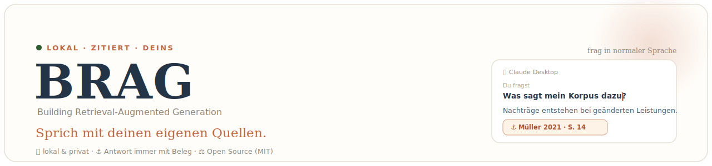
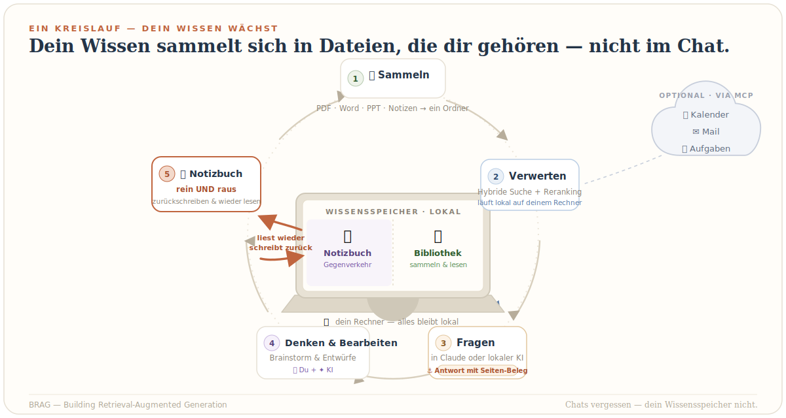

# BRAG — Building Retrieval-Augmented Generation

**🇬🇧 [English](README.md) | 🇩🇪 Deutsch**  ·  **Version 0.3.2** ([Änderungen](#versionen))

> **Ein KI-Assistent, der deine eigenen Quellen wirklich kennt.** Leg deine Dokumente — PDFs, Word, PowerPoint, deine eigenen Notizen — in einen Ordner. BRAG erschließt sie **auf deinem Rechner** und reicht der KI bei jeder Frage genau die passenden Stellen — seitengenau belegt, ein Klick führt aufs Original. Ob die KI dabei lokal oder in der Cloud rechnet, entscheidest du; gesendet werden höchstens deine Frage und die passenden Stellen — nie der ganze Korpus.

## Was es tut

<p align="center">
  
</p>

Du pflegst einen Ordner mit Dateien. BRAG macht daraus einen durchsuchbaren Wissensspeicher und reicht der KI bei jeder Frage genau die passenden Stellen — so kommt jede Antwort **seitengenau belegt**, mit Link direkt zur Quelle. Zitate, die du behalten willst, werden in denselben Ordner zurückgeschrieben: Dein Wissen sammelt sich damit **in Dateien, die dir gehören**, nicht in einem Chatverlauf, der vergisst. Ein neuer Chat morgen — auch bei einem anderen Modell — knüpft genau dort an, wo du aufgehört hast.

Drei Dinge machen den Unterschied:

- **Lokal und deins.** Suchindex und Dokument-Analyse laufen auf deinem Rechner. Auch das Antworten kann **vollständig lokal** geschehen: BRAG ist ein offener MCP-Dienst und lässt sich an ein lokales Modell (Ollama, LM Studio) koppeln — dann verlässt nichts deinen Rechner. Wählst du den bequemen Cloud-Weg, gehen nur deine Frage und die passenden Stellen ans Modell, nie der ganze Korpus.
- **Belegt, nicht geraten.** Eine hybride Suche (Bedeutung *und* Stichwort, mit Reranking) findet die Stellen, die wirklich relevant sind, und die Antwort zeigt dir die Seite — du kannst sie selbst nachprüfen.
- **Ohne Programmierkenntnisse.** Ein Doppelklick-Installer und ein Browser-Wizard übernehmen die Verkabelung des Standardwegs (Claude Desktop); du wählst deinen Anbieter, den Rest macht BRAG.

> *Der Name ist ein Wortspiel — mit meinem Fach, dem Bauingenieurwesen, in dem man Dinge* ***baut***, *und mit dem, was das Werkzeug tut: Es baut dein Wissen auf und ruft es bei Bedarf wieder ab.*

*Zum Funktionsumfang (v0.3.2): Das Fragen läuft standardmäßig über Claude Desktop; das Setup trägt die Such- und Notizbuch-Werkzeuge zusätzlich automatisch in **LM Studio** ein, falls installiert — für einen vollständig lokalen Pfad. (Ollama ist ein lokales Modell-Backend, kein MCP-Host; die Werkzeuge werden vom Chat-Client genutzt, nicht von Ollama selbst.) Weitere MCP-fähige Clients lassen sich ebenfalls anbinden — Claude Code baut dir die Brücke; siehe [Ausbau](#ausbau--automatisierung-mit-claude-code--co). ChatGPT ist als Frage-Oberfläche noch nicht vorkonfiguriert. Zitate werden automatisch in den Ordner zurückgeschrieben; eigene Schlussfolgerungen als freie Notizen festzuhalten ist eine optionale Obsidian-Erweiterung (siehe [Doku](docs/OBSIDIAN.de.md)).*

## Für wen?

Forschende, Lehrende und Promovierende — und genauso Praktiker, die im Projektalltag den Überblick über Normen, Berichte, Leistungsverzeichnisse und Fachliteratur behalten müssen. **Ohne Programmierkenntnisse nutzbar.**

---

## Was du damit machst

- 🔎 **Finden statt blättern** — *„Was sagt die VOB/B zur Behinderungsanzeige?"*
  oder *„Was steht in meinen Unterlagen zum Nachtragsmanagement?"* Antwort mit
  Seitenbeleg, ein Klick öffnet das PDF an genau der Stelle.
- 📑 **Verträge, Normen & LV durchsuchen** — *„Welche Frist nennt der Bauvertrag
  für die Mängelrüge?"*, *„Welche LV-Position deckt die Erdarbeiten ab?"* — die
  richtige Klausel oder Position seitengenau statt stundenlang blättern.
- 🗂️ **Bautagebuch & Schriftverkehr auswerten** — *„Wann wurde die Behinderung
  an der Attika erstmals dokumentiert?"* — quer über Tagesberichte, Protokolle
  und Baustellen-Mails, jede Aussage belegt.
- 📊 **Zahlen & Tabellen ziehen** — *„Zeig mir die Mengen und Kostenkennzahlen
  aus der Kalkulation"* — auch Tabellen und Abbildungen werden inhaltlich erfasst
  und sind so auffindbar.
- ✍️ **Schreiben mit Belegen** — Entwurf einer Behinderungsanzeige, einer
  Aktennotiz oder eines Nachtrags: *„Bau den Text aus diesen Passagen, Belege
  beibehalten."* Zitierfähige Stellen sammelst du schon beim Lesen.
- 🏗️ **Nach Projekt/Baustelle filtern** — *„Such **nur im Projekt Schulzentrum**:
  Welche Position deckt die Erdarbeiten ab?"* — jedes Vorhaben sauber getrennt.
- 🧠 **Entscheidungen & Wissen festhalten** — Zitate landen automatisch in deinem
  Wissensspeicher, eigene Schlussfolgerungen optional über Obsidian; ein neuer
  Chat Tage später macht genau dort weiter, wo der letzte aufhörte.
- 🎓 **… und natürlich Forschung & Lehre** — *„Entwirf drei Prüfungsfragen aus
  Kapitel 4, mit Seitenangaben"* oder *„Wo widersprechen sich meine Quellen zu
  Reifegradmodellen?"*

Der Kerngedanke: **Chats vergessen — dein Wissensspeicher nicht.** Wissen sammelt sich in
deinen Dateien an, nicht in einem flüchtigen Chatverlauf.

Ein „zweites Gehirn" ist keine neue Idee. Ich habe versucht, eine Variante zu
bauen, die im Alltag wirklich trägt — kein Hype, kein Lock-in, einfach Dateien,
die dir gehören. Ich arbeite selbst täglich damit und finde, es lässt sich gut
auf andere Arbeitskontexte übertragen — aber das musst du beurteilen: Über
Feedback, Kritik und alle, die es ausprobieren möchten, freue ich mich wirklich.

## Die Idee: eine Bibliothek und ein Notizbuch

Ein „Second Brain" für dein Projekt — ob Forschung, Lehre oder die tägliche
Praxis — hat zwei Hälften, und ihre strikte Trennung ist der Kern dieses Designs:

|  | 📚 **Deine Bibliothek** | 📓 **Dein Notizbuch** |
|---|---|---|
| Ordner | `RAG-Verbindungsordner/sources/` | `RAG-Verbindungsordner/wiki/`, `RAG-Verbindungsordner/notes/` |
| Enthält | externe Quellen: Paper, Bücher, Berichte | **dein eigenes Denken**: Konzepte, Entwürfe, Lesenotizen |
| Von Claude durchsuchbar? | ja — hybride Suche mit seitengenauen Belegen | bewusst **nein** |
| Kann Claude lesen/schreiben? | nur lesen (über die Suche) | ja — über die optionale Obsidian-Anbindung |

**Dazu eine dritte Ebene dazwischen — gespeicherte Passagen.** Wenn du Claude
(in Claude Desktop) sagst *„speichere diese Passage"*, schreibt es das Zitat
(mit Quelle und Seite) nach `RAG-Verbindungsordner/passages/` **und indexiert es** —
sodass jeder spätere Chat, sogar bei einem anderen KI-Anbieter, es über `search`
wiederfindet, klar als *deine gespeicherte Passage* markiert. Das ist kuratierte
Evidenz, die du behalten wolltest (ein echtes Zitat aus einer echten Quelle),
nicht der eigene Output der KI — genau deshalb ist sie durchsuchbar, der Rest des
Notizbuchs hingegen nicht.

**Warum ist der Rest des Notizbuchs vom Suchindex ausgeschlossen?** Wegen des
Echo-Effekts: Wären deine eigenen Konzeptnotizen und Auto-Zusammenfassungen
indexiert, würdest du eines Tages deine eigene Zusammenfassung eines Papers
„finden" und als Beleg zitieren — ohne zu merken, dass du dich selbst zitierst.
Die Bibliothek beantwortet *„Was sagen meine Quellen?"*; das Notizbuch enthält,
*was du daraus machst*. Claude arbeitet mit beidem — verwechselt sie aber nie.

### Dein Notizbuch — und warum einfache Markdown-Dateien

Das Notizbuch (`wiki/`) ist der Teil, der aus der Suche ein *zweites Gehirn*
macht: Hier steht **dein** Denken — Konzeptseiten, Argumentationslinien, offene
Fragen, Entscheidungen. Nicht, was die Quellen sagen, sondern was *du* daraus
machst.

**Warum als einfache Markdown-Dateien (`.md`)?** Markdown ist nur Text mit ein
paar Zeichen für Überschriften, Listen und Links. Klingt unspektakulär — ist
aber der entscheidende Vorteil:

- **Es gehört dir und hält.** Eine `.md`-Datei öffnest du in 20 Jahren noch, mit
  jedem Editor, ohne Spezialprogramm und ohne Abo. Kein proprietäres Format,
  kein Anbieter, der dichtmacht — kein Lock-in.
- **Es läuft überall.** Dieselbe Datei lesen und schreiben Obsidian, Claude,
  dein Texteditor, dein Backup, Git. Verschieben, kopieren, sichern wie jede
  andere Datei.
- **Es lässt sich verknüpfen.** Mit `[[Wikilinks]]` verbindest du Konzepte zu
  einem Netz — dein Wissen wird durchwanderbar statt in Dokumenten vergraben.

**Der unbequeme Teil:** Ein zweites Gehirn entsteht nicht von allein — du musst
dir das **Dokumentieren angewöhnen.** Die Quellen sammeln sich automatisch,
deine Erkenntnisse nicht. Faustregel: nach einem guten Gespräch mit Claude oder
einer wichtigen Lesestelle **kurz festhalten, was hängenbleibt** — lieber drei
unfertige Sätze als die perfekte Notiz, die nie entsteht. Claude kann dir beim
Schreiben helfen (über die Obsidian-Anbindung). Mit der Zeit wird daraus, was
kein Chatverlauf je sein kann: **dein** wachsendes, durchsuchbares Wissen.

## Wie es funktioniert


Alles läuft in zwei Docker-Containern auf deinem Rechner. Im Cloud-Profil
verarbeitet ein KI-Anbieter nur die Dokumenttexte; in den Lokal-Profilen
verlässt nichts deinen Rechner. Eine ausführliche, technikfreie Erklärung steht
in **[So funktioniert's](docs/HOW_IT_WORKS.de.md)** — hier das Wichtigste.

**Was ist Docker?** Statt Python, Datenbanken und KI-Bibliotheken einzeln zu
installieren (und mit Versionskonflikten zu kämpfen), startet Docker eine fertig
geschnürte Box, die auf jedem Rechner identisch ist. Du installierst einmal
Docker Desktop; den Rest startet das Projekt. Die ~3 GB Modelle liegen in Dockers
verwaltetem Speicher — **nicht** in deinem Projektordner; dein `RAG-Verbindungsordner/` enthält
nur deine eigenen Dateien.


Die Antwortqualität entsteht in zwei Abläufen:

**Beim Einlesen** schreibt eine KI zu jedem Textabschnitt 1–2 einordnende Sätze
(*Contextual Retrieval*) — knapper Fachtext wird so überhaupt erst auffindbar.
Abbildungen werden von einem multimodalen Modell beschrieben (*Vision-Pass*).
Jeder Abschnitt bekommt zwei „Fingerabdrücke": einen für die **Bedeutung**
(semantische Suche) und einen für **exakte Begriffe** (Stichwortsuche).

**Bei jeder Frage** läuft die Abfragepipeline — von der Frage bis zum Beleg:

1. **Zwei Suchen gleichzeitig** — Bedeutungssuche (findet Sinnverwandtes, auch
   mit anderen Worten) **und** Stichwortsuche (BM25; findet exakte Begriffe wie
   Abkürzungen, Paragraphen, Aktenzeichen). Je ~80 Kandidaten.
2. **Zusammenführen (RRF)** — beide Listen verschmelzen; ~40 bleiben übrig.
3. **Reranker** — ein Cross-Encoder liest deine Frage gemeinsam mit jeder Stelle
   und sortiert nach echter Passung. Der Unterschied zwischen „enthält die
   Suchworte" und „beantwortet die Frage". Er läuft **lokal auf deiner CPU** —
   der teuerste Teil einer Suche — daher ist sein Aufwand einstellbar:
   `RERANK_PROFILE=off/eco/balanced/full` (Standard `eco`; auf schwachen PCs
   `off`/`eco`, auf starken `full`).
4. **Kürzen** — die besten Treffer bleiben (Standard 15, max. 3 je Quelle).
5. **Antworten** — Claude formuliert aus genau diesen Stellen, jede Aussage mit
   Quelle und Seite belegt.

Mehr Tiefe (mit Zahlen) in [So funktioniert's](docs/HOW_IT_WORKS.de.md) und
[Architektur](docs/ARCHITECTURE.de.md); alle Parameter in [`.env.example`](.env.example).

### Der KI-Anschluss (MCP)

Automatisch eingerichtet, gibt der **BRAG-MCP-Server** deinem Assistenten einen
Anschluss mit zwei Werkzeug-Sätzen — über deine **Bibliothek** (Suche) und dein
**Notizbuch** (Lesen/Schreiben); die Notizbuch-Werkzeuge fassen den Suchindex nie
an. Das Setup trägt das in **Claude Desktop** ein — und in **LM Studio**, falls
installiert (LM Studios Chat ist ein MCP-Host). *Ollama ist ein Modell-Backend,
kein MCP-Host — es liefert das lokale Modell, dort gibt es nichts einzurichten.*
Die Werkzeuge:

| Werkzeug | Was es tut | Beispielfrage |
|---|---|---|
| `search` | Hybride Suche mit Filtern (Typ, Jahr, nur Tabellen/Abbildungen, Quelle) | *„Was sagt mein Korpus zum Nachtragsmanagement?"* |
| `list_sources` | Inventar aller indexierten Dokumente | *„Welche Dokumente sind in meiner Wissensbasis?"* |
| `inspect_chunks` | Zeigt, was zu einer Quelle gespeichert ist (Diagnose) | *„Zeig, was von Müller 2023, S. 14 indexiert wurde."* |
| `save_passage` | Speichert einen zitierfähigen Treffer unter einem Thema | *„Speichere dieses Zitat fürs Methodenkapitel."* |
| `list_passages` | Zeigt gesammelte Passagen pro Thema | *„Was habe ich fürs Methodenkapitel schon gesammelt?"* |
| `remove_source` | Entfernt eine Quelle aus dem Index; verschiebt die Datei nach `sources/_inbox/` (umkehrbar, nicht gelöscht) | *„Entferne den veralteten Entwurf aus meinem Index."* |
| `rename_source` | Benennt ein indexiertes Dokument um; Metadaten an Ort und Stelle, kein erneutes Embedding | *„Benenne Müller_2023_Entwurf in den finalen Titel um."* |
| `list_notebook` | Listet dein Notizbuch (Wiki-Seiten + Literaturnotizen) | *„Was steht in meinem Notizbuch?"* |
| `read_note` | Liest eine Notizbuch-Seite | *„Öffne meine Notiz zur Prozessreife."* |
| `write_note` | Erstellt/aktualisiert eine Wiki-Seite (nie indexiert) | *„Speichere diese Schlüsse als Wiki-Notiz."* |

**Notizen auch in Obsidian bearbeiten (optional).** Claude kann dein Notizbuch
bereits über die Werkzeuge `list_notebook` / `read_note` / `write_note` oben lesen
und schreiben. Um Notizen zusätzlich in Obsidians eigener Oberfläche zu
bearbeiten, richte Obsidian auf denselben Wissensordner; das Plugin **MCP Tools
für Obsidian** lässt Claude zudem innerhalb von Obsidian agieren. Anleitung:
[docs/OBSIDIAN.de.md](docs/OBSIDIAN.de.md).

Mit beiden zusammen: *„Such Definitionen von Prozessreife (Bibliothek),
vergleiche mit meiner Konzeptnotiz (Notizbuch) und ergänze, was fehlt — mit
Belegen."*

## Wähle dein Profil

Das Profil wählt nur die **Text-KI** (Kontext schreiben, Abbildungen
beschreiben). Der **Bedeutungs-Index (Embeddings) läuft immer
lokal** (arctic-Modell, keine GPU nötig) — du kannst den Anbieter also jederzeit
wechseln, **ohne neu zu indexieren.**

| Profil | Text-KI | Günstigstes Modell | Hardware | Daten verlassen Rechner |
|---|---|---|---|---|
| **Gemini** (Standard) | Google Gemini (Free Tier) | gemini-2.5-flash-lite | jeder Laptop | ja (Google) |
| **OpenAI** | OpenAI / ChatGPT | gpt-4o-mini | jeder Laptop | ja (OpenAI) |
| **Claude** | Anthropic Claude | claude-haiku-4-5 | jeder Laptop | ja (Anthropic) |
| **Hybrid** | LM Studio (auf deinem Mac) | dein lokales Modell | Apple Silicon, 32 GB+ | nein |
| **Lokal** | Ollama (auf deinem Rechner) | llama3.1 | ordentliche CPU, 16 GB+ | nein |

**Welche Hardware schaltet welche Stufe frei?** Cloud-Profile laufen auf jedem
Rechner; lokale Text-KI und ein voll aufgedrehter Reranker brauchen mehr:

| Stufe | Hardware | Schaltet frei | Preis |
|---|---|---|---|
| **Leicht** | 8 GB Minimum, 16 GB komfortabel; jeder Rechner, keine GPU | Cloud-LLM, lokaler Index, Reranker sparsam/aus | API-Key nötig; Dokumenttext geht an Anbieter; der erste Ingest ist RAM-intensiv |
| **Mittel** | ~16 GB RAM | + Reranker flüssig, optional erstes lokales LLM (Ollama) | lokales LLM langsamer/schwächer |
| **Privat-lokal** | M-Mac 32 GB, LM Studio | lokales LLM (z. B. qwen-14b), Reranker voll, Vision lokal | nichts verlässt den Rechner; mehr Setup |
| **Voll-Version** | M-Mac 64 GB+, LM Studio | großes lokales LLM (z. B. gemma-27b) + Vision + Reranker voll | höchste Qualität, höchste Last |

### Suchqualität einstellen: der Reranker

Nach der hybriden Suche kann ein zweiter Schritt die gefundenen Stellen noch
einmal nach Passgenauigkeit sortieren — ein **Cross-Encoder** (`bge-reranker-v2-m3`,
lokal auf deiner CPU — keine Grafikkarte nötig), der deine Frage gemeinsam mit jeder Stelle liest. Das ist
der rechenintensivste Teil einer Suche; deshalb wählst du über `RERANK_PROFILE`
(im Setup-Wizard oder in `.env`), wie gründlich er arbeitet. „Geladen" = wie
viele Kandidaten aus der Suche gezogen werden (Bedeutungs- und Stichwortsuche
zusammen, je nach Profil unterschiedlich), „nachsortiert" = wie viele davon der
Cross-Encoder bewertet:

| Einstellung | geladen | nachsortiert | Tempo / Qualität | für |
|---|---|---|---|---|
| `off` | 160 (80+80) | 0 — reine RRF-Fusion | am schnellsten, mehr Rauschen | sehr schwache Rechner, kleiner Korpus |
| `eco` *(Standard)* | 160 (80+80) | 40 | schonend, gute Qualität | normale Notebooks (16 GB komfortabel) |
| `balanced` | 240 (120+120) | 60 | etwas langsamer, schärfer | Mittelklasse |
| `full` | 400 (200+200) | 120 | am langsamsten, beste Reihenfolge | starke Maschinen (M-Chip, 32 GB+) |

**Was „aus" praktisch bedeutet:** Die Treffer kommen dann direkt aus der
RRF-Fusion von Bedeutungs- und Stichwortsuche — beide Zweige bleiben gefüllt, es
„kippt" also nichts, aber die *wichtigste* Stelle steht seltener ganz oben. Da
ein LLM bevorzugt die oberen Treffer zitiert, lohnt der Reranker besonders bei
spitzen Faktenfragen und bei **gemischten DE/EN-Korpora** (dort stützt er die
Trefferqualität spürbarer). Einzelwerte lassen sich bei Bedarf über
`RERANK_ENABLED` / `RERANK_PREFETCH` / `RERANK_FUSION_LIMIT` feinjustieren.

Bei einem Cloud-Profil geht der **Textauszug** jedes Abschnitts an den Anbieter —
bei aktivem Vision-Pass (Standard) zusätzlich die **Bilder deiner Abbildungen**.
Nie übermittelt werden ganze Dateien und die Embeddings. Bei lokalen Profilen
verlässt nichts den Rechner.

> ⚠️ **Datenschutz, kurz und ehrlich:** Beim **kostenlosen Gemini-Tarif**
> (Standard) darf Google die übermittelten Texte/Bilder auswerten. Faustregel:
> Was du Claude bisher nicht anvertraut hättest, lädst du auch hier nicht hoch.
> Für Vertrauliches oder Personenbezogenes nimmst du einfach ein **lokales
> Profil** (dann verlässt nichts den Rechner) oder schaltest den Bildversand mit
> `VISION_ENABLED=false` ab. Und wer's elegant will, baut sich eine
> Anonymisierung als eigenes Tool davor (siehe [Ausbau](#ausbau--automatisierung-mit-claude-code--co)).
> Mehr unter [Rechtliches & Datenschutz](#rechtliches--datenschutz).

**Kosten:** Jedes Profil ist auf sein günstigstes brauchbares Modell
voreingestellt; für einen typischen Korpus bleiben die Kosten im **Cent-Bereich**.
**Hardware:** Starke Hardware brauchst du nur für eine *lokale* Text-KI — die
Embeddings laufen überall auf der CPU. Details, Modell-Empfehlungen und das
Cloud-Embedding-Opt-in: [docs/PROFILES.de.md](docs/PROFILES.de.md).

## Einrichten — realistisch etwa 1 Stunde

Aktiv zu tun ist nur etwa **15 Minuten**; der Rest sind **Downloads** (Docker
Desktop, Claude Desktop und einmalig ~3 GB Analyse-Modelle beim ersten Start) —
rechne bei einer Erstinstallation also mit insgesamt rund **30–60 Minuten**. Es
läuft auf einem **normalen Rechner** — mit einem Cloud-Profil (dem Standard)
sind **8 GB RAM das Minimum, 16 GB komfortabel** (am meisten Speicher zieht der
erste Ingest, der den lokalen Index und das Reranker-Modell lädt), jede moderne
CPU genügt und **eine Grafikkarte ist nicht nötig**. Starke Hardware brauchst du
nur, wenn du auch die *Text*-KI lokal betreibst (siehe Profiltabelle oben).

**Du brauchst** (alles kostenlos): [Docker Desktop](https://www.docker.com/products/docker-desktop/),
[Claude Desktop](https://claude.com/download) und einen API-Schlüssel —
am einfachsten [Gemini](https://aistudio.google.com/apikey) (Free Tier);
alternativ [OpenAI](https://platform.openai.com/api-keys) oder
[Anthropic](https://console.anthropic.com/). Lieber alles lokal? Geht auch —
mit [LM Studio](https://lmstudio.ai) oder [Ollama](https://ollama.com).

1. **Herunterladen & ablegen:** grüner „Code"-Knopf → „Download ZIP". Leg die
   ZIP an einen festen, gut erreichbaren Ort — z. B. in dein Projekt- oder
   Arbeitsverzeichnis oder einen übergeordneten Ordner (gern auch in OneDrive) —
   und **entpacke sie dort**. Dieser Projektordner bleibt dauerhaft liegen (er
   enthält die Steuerung, deine Konfiguration und standardmäßig deinen
   Wissensspeicher) — verschieben ist ok, löschen nicht.
2. **Doppelklick** auf `setup.command` (Mac) bzw. `setup.bat` (Windows). Der
   Assistent öffnet sich **im Browser** und fragt in einfacher Sprache: wo die
   KI rechnen soll, deinen Schlüssel (mit Live-Prüfung), die Dokumentsprache.
   Er schreibt die ganze Konfiguration selbst — **du editierst nie eine Datei.**
3. **Claude Desktop komplett beenden** (Cmd+Q / Tray → Beenden) und neu öffnen.
4. **Ein PDF in `RAG-Verbindungsordner/sources/` legen** — binnen Sekunden automatisch indexiert.
5. Claude fragen: *„Welche Dokumente sind in meiner Wissensbasis?"*

**Läuft alles?** Doppelklick auf `status.command` (Mac) bzw. `status.bat`
(Windows) prüft mit einem Klick Docker, Qdrant, den Watcher, den Korpus und den
KI-Anschluss — ✓/✗ pro Punkt.

**BRAG entfernen?** Doppelklick auf `uninstall.command` (Mac) bzw. `uninstall.bat`
(Windows): entfernt Container, Modell-Cache, App-Image und die
Claude-Desktop-Verbindung — **deine Dokumente** (`RAG-Verbindungsordner/`) und der
Suchindex **bleiben erhalten**, eine Neuinstallation findet sie wieder. Den
Projektordner danach löschen, wenn du die Dateien nicht mehr brauchst.

**Etwas klemmt?** Schau zuerst in die [FAQ & Fehlerbehebung](docs/FAQ.de.md) —
sie deckt die häufigen Fälle ab. Sieht es nach einem echten Bug aus, [öffne bitte
ein GitHub-Issue](../../issues): mit Betriebssystem, genutztem Profil, was du
getan hast und was passiert ist, plus der Status-Ausgabe von oben (Details in
[CONTRIBUTING](CONTRIBUTING.md)).

> **Neu im Terminal?** Ein paar Schritte — hier und in den
> Installationsanleitungen — verlangen, dass du einen Befehl ins Terminal
> (macOS) bzw. die Eingabeaufforderung (Windows) tippst oder ein kleines Skript
> ausführst. Falls das neu für dich ist: lass dir Zeit und lies jeden Schritt in
> Ruhe — und du musst das nicht allein machen: ein KI-Assistent wie
> [Claude Code](https://claude.com/claude-code) führt dich Schritt für Schritt
> durch die Befehle und erklärt dir, was jeder davon tut.

Der erste Start lädt einmalig ~3 GB Analyse-Modelle. Ausführlich, mit „was du
siehst": [Installation macOS](docs/INSTALL_MAC.de.md) ·
[Windows](docs/INSTALL_WINDOWS.de.md).

## Dein Wissensspeicher

Hier die wichtigste Unterscheidung — **zwei Ordner, zwei Rollen:**

- **Der Projektordner** = das **Programm** (die entpackte ZIP). Den brauchst du
  zum Starten/Stoppen; **nicht löschen.** *Wo* er liegt, ist egal
  (Arbeits-/Projektverzeichnis, OneDrive …) — Hauptsache, er bleibt liegen.
- **Dein Wissensspeicher** = deine **Inhalte**. Standardmäßig ist das der
  Unterordner `RAG-Verbindungsordner/` *im* Projektordner. Beim Setup kannst du
  stattdessen einen **bestehenden Ordner** angeben — z. B. deinen vorhandenen
  „Projekt XY"-Ordner — und ihm beim Einrichten Zugriff geben.

**Die eine Regel, die alles erklärt:** Durchsucht wird genau **dieser eine
Ordner**. Alles, was du in `sources/` legst, wandert automatisch in die
Suchdatenbank (den Index); nimmst du eine Datei wieder heraus oder löschst sie,
verschwindet sie auch aus der Datenbank. Sonst wird **nichts** auf deinem
Rechner angefasst.

So ist der Wissensspeicher aufgebaut:

```
RAG-Verbindungsordner/
├── CLAUDE.md      ← bringt Claude dein Fachgebiet bei (hier trägst du es ein)
├── AGENTS.md      ← Zusatzregeln für autonome Agenten-Aufgaben
├── sources/       ← 📚 Dokumente hier ablegen (PDF, DOCX); Unterordner = Dokumenttypen
│   └── _inbox/    ← Staging-Bereich, ignoriert (hier parkt auch remove_source entfernte Quellen)
├── notes/         ← auto-generierte Literaturnotiz pro Quelle
├── passages/      ← über Claude gespeicherte Zitate, nach Themen
└── wiki/          ← 📓 dein eigenes Denken — wird nie indexiert
```

Änderungen in `sources/` werden automatisch nachgezogen: Benennst du eine
**bereits indexierte** Datei um oder **verschiebst** sie (auch zwischen
Unterordnern), werden nur die Metadaten (Autor, Jahr, Typ, PDF-Pfad) an Ort und
Stelle aktualisiert — **ohne neu einzulesen** (kein erneutes Embedding, keine
API-Kosten); **überschreibst** du eine Datei mit einer neuen Version, wird sie neu
indexiert; **löschst** du sie, verschwindet sie aus der Datenbank (Löschungen,
während die App aus war, werden beim nächsten Start aufgeräumt). Der **erste**
Unterordner-Name wird zum filterbaren Dokumenttyp (`sources/Paper/`,
`sources/Berichte/` …); tiefer verschachteln kannst du für eigene Tags (siehe unten).

**Eigene Metadaten** (Projekt, Kurs, Auftraggeber …) gibst du über eine
`_meta.txt` in einem Ordner unter `sources/` an — eine Zeile pro `schlüssel: wert`;
so mischen sich keine Treffer aus anderen Projekten in deine Ergebnisse. Stimmen
die gedruckten Seitenzahlen nicht mit den physischen PDF-Seiten überein, regelt
ein `page_offset` in derselben Datei, dass der Beleg die *gedruckte* Seite zeigt.
Beide Felder im Detail (mit Beispielen): [docs/FAQ.de.md](docs/FAQ.de.md).

```
# sources/Projekte/Schulzentrum/_meta.txt
projekt: Schulzentrum
auftraggeber: Stadt Hamm
page_offset: 14
```

Du kannst **beliebig tief verschachteln**, und `_meta.txt`-Dateien **stapeln sich
von `sources/` hinab bis zum Ordner des Dokuments — tiefer überschreibt**. Setz
also grobe Tags weit oben und verfeinere sie weiter unten:

```
sources/Projekte/_meta.txt                     →  auftraggeber: Stadt Hamm
sources/Projekte/Schulzentrum/_meta.txt        →  projekt: Schulzentrum
sources/Projekte/Schulzentrum/2024/_meta.txt   →  phase: Ausführung
```

Ein Dokument in `…/Schulzentrum/2024/` trägt dann `auftraggeber`, `projekt`
**und** `phase` — alles in der Suche filterbar (*„such nur im Projekt
Schulzentrum"*). Die einzige Regel: nur der **erste** Unterordner unter
`sources/` bestimmt den **Dokumenttyp**; alles Tiefere dient allein deinen
`_meta.txt`-Tags.

**Ändern wirkt sofort:** Legst du eine `_meta.txt` an oder bearbeitest sie
nachträglich, frischt BRAG die Metadaten der bereits indexierten Dokumente
dieses Ordners — und aller geschachtelten Dokumente, die davon erben —
automatisch auf, ohne neu einzulesen.

**Im Alltag** legst du neue Literatur einfach in `sources/` ab (in Minuten
indexiert) und fragst Claude, was sie zu deinem Bestand ergänzt oder ob sie ihm
widerspricht — Antwort mit seitenverlinkten Belegen. Korrigierst du Claude
zweimal dieselbe Sache, gehört die Korrektur in **`RAG-Verbindungsordner/CLAUDE.md`**,
nicht in den nächsten Chat — eine gepflegte Instruktionsdatei macht aus einem
generischen Assistenten *deinen* (Beispiele:
[docs/CUSTOMIZE_CLAUDE.de.md](docs/CUSTOMIZE_CLAUDE.de.md)).

### Obsidian: ein schönerer Blick auf denselben Ordner

Du kannst den Wissensspeicher mit [Obsidian](https://obsidian.md) (kostenlos)
öffnen — es stellt die Markdown-Dateien viel schöner dar und macht das Schreiben
im Notizbuch angenehm. Wichtig zu verstehen: **Obsidian ist kein zweiter
Speicher, sondern nur eine Ansicht auf genau denselben Ordner.** Es arbeitet
direkt auf den Dateien — **löschst du eine Datei in Obsidian, ist sie auch im
normalen Ordner (und damit aus dem Index) weg.** Nichts wird importiert oder
kopiert; es ist dieselbe Struktur, nur bequemer zu bedienen. Schritt für Schritt:
[docs/OBSIDIAN.de.md](docs/OBSIDIAN.de.md).

## Ausbau & Automatisierung (mit Claude Code & Co.)

Das Fundament ist bewusst offen: einfache Dateien, übersichtliche Python-Module,
Docker und **MCP** — derselbe offene Standard, über den Claude seine Werkzeuge
anspricht. Das macht das Projekt zu einer **Basis zum Weiterbauen**, nicht zu
einer geschlossenen App. Mit **Claude Code** oder einem anderen Coding-Agenten
kannst du den Code lesen lassen, neue Werkzeuge ergänzen und Abläufe
automatisieren — die [Architektur](docs/ARCHITECTURE.de.md) ist dafür
dokumentiert.

Mögliche Ausbaurichtungen (offene Architektur, noch nicht fertig eingebaut):

- **Vollständig lokaler Antwortpfad** — weil BRAG ein offener MCP-Dienst ist, kannst du seine Suchwerkzeuge statt an Claude Desktop an einen lokalen Chat-Client koppeln, der **Ollama oder LM Studio** als Antwortmodell nutzt. Dann läuft die ganze Kette — Index, Dokument-Analyse und Antwort — auf deinem Rechner, ideal für vertrauliche Bestände. Die MCP-Brücke dafür lässt sich mit **Claude Code** in wenigen Schritten erzeugen.
- **Weitere Datenquellen anbinden** — E-Mail und Kalender, Cloud-Speicher,
  Referenzmanager (z. B. Zotero), Webseiten/Feeds: als zusätzliche Quellen oder
  als eigene MCP-Werkzeuge, die Claude im selben Gespräch nutzt.
- **Fachsoftware integrieren** — projektspezifische Anbindungen an die Programme
  deines Felds (z. B. AVA/Baukalkulation, ERP, Dokumentenmanagement), damit
  Claude auch dort nachschlagen oder Einträge vorbereiten kann.
- **Automatisierungen** — automatische Datei-Benennung, regelmäßige
  Zusammenfassungen neuer Quellen, watcher-getriggerte Reports, geplante
  Aufgaben über Agenten-Sitzungen (Regeln dafür in `RAG-Verbindungsordner/AGENTS.md`).

Ein Coding-Agent kann genau solche Erweiterungen Schritt für Schritt umsetzen —
ein neues MCP-Werkzeug hier, ein zusätzlicher Pipeline-Schritt dort. Wenn du in
diese Richtung baust, freue ich mich über Beiträge zurück ins Projekt.

## Rechtliches & Datenschutz

Kurzfassung — Details und der vollständige Hinweis: **[docs/LEGAL.de.md](docs/LEGAL.de.md)**.

- **Ohne Gewähr.** Open Source unter [MIT](LICENSE), „wie besehen", ohne
  Garantie für Datenschutz oder Rechtskonformität. Nutzung auf eigene
  Verantwortung.
- **KI-Ausgaben prüfen.** KI-generierte Antworten und Zitate können falsch oder
  erfunden sein; prüfe sie stets anhand der verlinkten Originalseite, bevor du
  dich darauf verlässt oder sie zitierst.
- **Dein API-Schlüssel bleibt lokal.** Er wird nur in einer lokalen
  `.env`-Datei auf deinem Rechner gespeichert (nur für dich lesbar) und dient
  ausschließlich dazu, deine eigenen Anfragen beim gewählten Anbieter zu
  authentifizieren — nie an die Macher dieser App oder an Dritte gesendet.
  Lokale Profile brauchen gar keinen Schlüssel.
- **Datenschutz.** Die ehrliche Faustregel steht oben im [Datenschutz-Hinweis bei
  den Profilen](#wähle-dein-profil): Lokale Profile geben nichts heraus,
  Cloud-Profile übermitteln Textauszüge (und bei Vision die Abbildungsbilder).
  Enthalten Dokumente personenbezogene Daten, bist du im Cloud-Fall in der Regel
  der DSGVO-Verantwortliche.
- **Beruflicher Einsatz.** Im Unternehmen oder in der Behörde — vor allem mit
  personenbezogenen Daten — vorab mit den zuständigen Stellen abstimmen
  (Datenschutzbeauftragte/r, IT-Sicherheit, ggf. Betriebsrat). Aus
  Datensicherheitssicht sind **lokale Profile bedenkenlos vorzuziehen**;
  IT-Abteilungen können BRAG für den Unternehmenseinsatz professionalisieren.
- **Urheberrecht.** Klar, technisch kannst du alles in den Ordner legen — aber
  für die Rechte an deinen Quellen bist du verantwortlich. Eigene
  wissenschaftliche Analyse rechtmäßig zugänglicher Werke kann unter die
  Text-und-Data-Mining-Schranken fallen (§ 60d / § 44b UrhG); Lizenzbedingungen
  können das einschränken. Für lizenzierte oder vertrauliche Werke ist die
  Antwort simpel: lokales Profil, dann bleibt alles auf deinem Rechner.

*Kein Rechtsrat (Stand Juni 2026). Im Zweifel fachkundigen Rat einholen.*

## Dokumentation

- **[So funktioniert's — in einfachen Worten](docs/HOW_IT_WORKS.de.md)** (kein Technik-Wissen nötig)
- [Installation macOS](docs/INSTALL_MAC.de.md) · [Installation Windows](docs/INSTALL_WINDOWS.de.md)
- [Backend-Profile](docs/PROFILES.de.md) · [Obsidian + Notizbuch-MCP anbinden](docs/OBSIDIAN.de.md)
- [Claude auf deine Arbeit einstellen](docs/CUSTOMIZE_CLAUDE.de.md)
- [Welche Claude-Oberfläche? Chat, Cowork oder Code](docs/WHICH_CLAUDE.de.md)
- [FAQ & Fehlersuche](docs/FAQ.de.md) · [Architektur](docs/ARCHITECTURE.de.md)
- ⚖️ [Rechtliche Hinweise (Datenschutz, Urheberrecht)](docs/LEGAL.de.md)

## Versionen

Aktuelle Version: **0.3.2** (Juni 2026). Vollständige Liste: [CHANGELOG.md](CHANGELOG.md).

- **0.3.2** — Härtung von Zuverlässigkeit, Sicherheit und Dokumentation nach
  einem vollständigen Pre-Publication-Audit. **Fixes:** gleichnamige Dateien in
  verschiedenen Ordnern überschreiben sich nicht mehr gegenseitig im Index
  (Datenverlust-Fix); Seitenbelege stimmen auch über mehrseitige Abschnitte;
  teilweise eingelesene Dokumente werden erneut versucht statt still Seiten zu
  verlieren; dazu Fixes für Watcher-Nebenläufigkeit, großes `top_k`,
  Embedding-Dimension und `inspect_chunks`. **Sicherheit:** Setup als eigener
  Einmal-Dienst — die Dauer-App mountet weder dein Projekt noch die
  Claude-Desktop-Konfig; Qdrant-Telemetrie aus; `.env`-Injection-Schutz;
  `SECURITY.md`. **Neu:** End-to-End- und Unit-Tests in der CI, `NOTICE.md`,
  Code of Conduct und Issue-/PR-Vorlagen, optionales Modell-Revision-Pinning und
  ein klarer Hinweis zum Umgang mit deinem API-Schlüssel. Migrationshinweis im
  [CHANGELOG](CHANGELOG.md).
- **0.3.0** — Projekt durchgängig umbenannt in **BRAG** (*Building
  Retrieval-Augmented Generation*) — inklusive Paket, Docker-Image und Containern
  (keine indexierten Daten gehen verloren; **bestehende Installationen führen das
  Setup einmal erneut aus**, siehe [CHANGELOG](CHANGELOG.md)).
  **Ein-Klick-Statuscheck** (Docker, Qdrant, Watcher, Korpus, KI-Backend,
  Claude-Anbindung). **Umbenennen einer indexierten Datei** ist jetzt ein
  leichtgewichtiges Metadaten-Update statt einer vollen Neu-Indexierung.
  Sicherheits-Härtung der Setup-Bridge (Host-Header-Allowlist, statische Dateien
  nur als Download, atomare Config-Schreibvorgänge). Wissensspeicher-Ordner
  umbenannt `vault/` → `RAG-Verbindungsordner/`. Neues Dokument: welche Claude-Oberfläche
  wann (Chat / Cowork / Code).
- **0.2.0** — Neben Google Gemini jetzt auch **OpenAI/ChatGPT** und
  **Anthropic/Claude** als Cloud-Anbieter. Zweisprachiger Einrichtungs-Assistent.
  Der Bedeutungs-Index (arctic) läuft in **jedem** Profil lokal (Anbieterwechsel
  ohne Neu-Indexierung). Überarbeitete Anleitung (Abfragepipeline, Docker, Kosten,
  Hardware, Recht). Neu: der **Vision-Pass** — Abbildungen werden inhaltlich
  beschrieben (Standard an, abschaltbar mit `VISION_ENABLED=false`).
- **0.1.0** — Erste Veröffentlichung: Gemini-Cloud-Profil, hybride Suche mit
  Reranking, Ordnerstruktur und Such-MCP für Claude Desktop.

## Status

Frühe Version (0.3.2). Das **Gemini-Profil** ist der getestete Hauptweg; die
übrigen Profile funktionieren, sind aber weniger erprobt. Roadmap: automatische
Dateibenennung, Korpus-Überblicksmodi (Coverage/Cluster), optionale
Wissensgraph-Ebene — und die oben skizzierten Anbindungen.

## Lizenz

[MIT](LICENSE). Modelle und Abhängigkeiten von Drittanbietern (jeweils unter
eigener Lizenz) sind in [NOTICE.md](NOTICE.md) aufgeführt.
